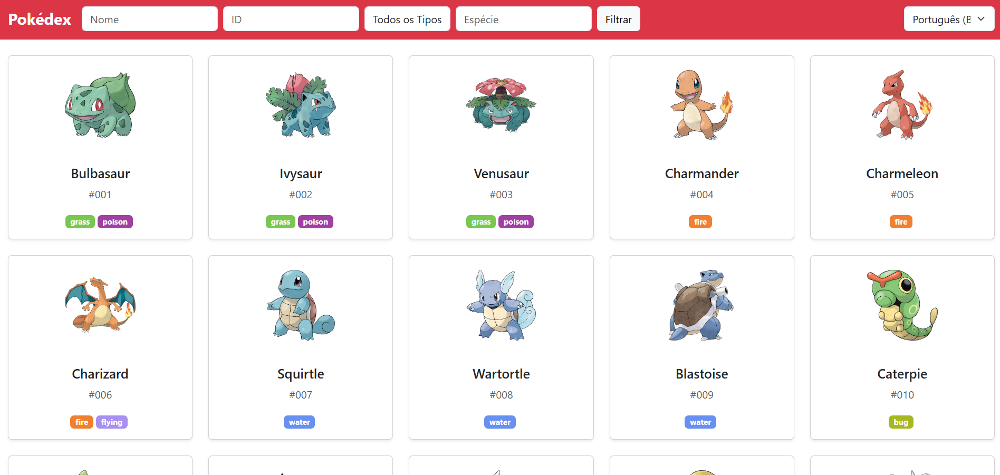

# 📌 Pokedex

Este projeto é uma Pokédex digital desenvolvida como parte do meu aprendizado em desenvolvimento web. A aplicação consome a <a href="https://pokeapi.co/#google_vignette">PokéAPI</a> para exibir informações sobre diversos Pokémon, incluindo suas características, tipos, estatísticas e evoluções.

# ✨ Funcionalidades
- Listagem de Pokemons com scroll infinito.
- Filtragem de pokemons com base por nome, ID, tipos e espécies.
- Visualização detalhada de cada pokemon (stats, golpes, linha evolutiva, aparição em jogos, etc).
- Responsividade para dispositivos mobile.

# 🛠 Tecnologias Utilizadas
- HTML, CSS, Bootstrap, Vue 3
- i18n para a internacionalização em pt-BR, en e es.
- Vitest para testes automatizados.
- Vuex para gerenciamento de estado de variáveis.

# 📸 Imagens do Projeto

# Upload do Site
Acesse a aplicação hospedada com o vercel: <a href="https://maino-challenge-pokedex.vercel.app/">Pokedex</a>
